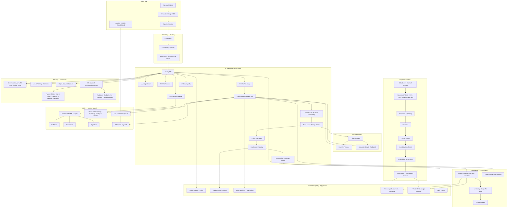

# Architecture Flowchart (Readable + GitHub-Native)

This document explains the pilot architecture in plain English and includes a GitHub-rendered flowchart.

## What format is this?
- This is **Markdown** (`.md`) with a **Mermaid** diagram.
- GitHub renders Mermaid automatically in Markdown files.
- If someone does not read diagrams, the plain-English sections below are the source of truth.

## System Purpose
Convert anonymous agency website traffic into qualified, high-intent travel leads, then hand those leads to human advisors with structured context and source grounding.

## End-to-End Flow (Human Readable)
1. A traveler opens an agency website and starts chat through the embedded widget.
2. The widget creates a signed session and sends messages to the backend API.
3. The orchestrator runs a gate router:
   - Interest discovery
   - Qualification
   - Recommendation/refinement
   - Concierge handoff
4. The orchestrator calls retrieval against tenant-specific agency knowledge (RAG), then asks model providers (OpenAI primary, Claude fallback) to generate a grounded response.
5. The assistant collects qualification slots (budget, dates, trip style, urgency, readiness).
6. When intent is high enough, it triggers concierge handoff and creates a CRM-ready payload.
7. Advisor receives escalation with summary + transcript excerpt + cited recommendations.
8. Funnel and reliability events are logged for analytics and operations.

## Key Architectural Decisions
- **B2B multi-tenant isolation:** tenant-scoped data and policy boundaries.
- **Hybrid gate routing:** hard rules first, model-based classification for ambiguous turns.
- **RAG-first recommendations:** generated suggestions are anchored to agency docs and policy.
- **Model failover:** OpenAI as primary path, Claude as fallback provider.
- **AWS minimal launch posture:** ECS/Fargate + Aurora Postgres/pgvector + CloudFront/ALB.

## Deployment Reality (Pilot Scope)
- Production-capable pilot architecture, not full enterprise scale yet.
- Single-task/single-AZ cost posture with clear scale-up path.
- Human-owned go-live dependencies remain: DNS/TLS, secrets, Terraform apply, alert routing, and pilot policy approvals.

## Architecture Diagram

## Reader Notes for Reviewers
- If you are reviewing for product viability, focus on: gate routing, handoff quality, and CRM payload completeness.
- If you are reviewing for technical readiness, focus on: tenant isolation, provider failover behavior, and deploy/rollback runbooks.
- If you are reviewing for pilot launch risk, focus on human-owned dependencies and alert ownership.
